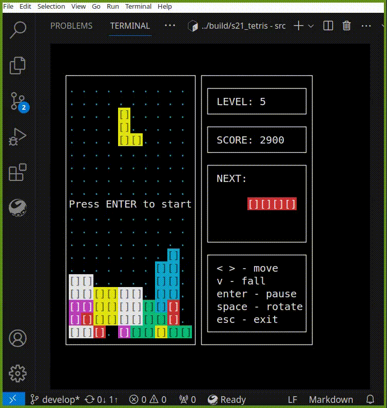

<a id="readme-top"></a>

<br />
<details>
  <summary><strong>Table of Contents</strong></summary>
  <ol>
    <li>
      <a href="#about-the-project">О проекте</a>
      <ul>
        <li><a href="#built-with">Инструменты разработки</a></li>
      </ul>
    </li>
    <li>
      <a href="#getting-started">Установка</a>
      <ul>
        <li><a href="#required-software">Предустановка</a></li>
        <li><a href="#installation">Таргеты</a></li>
      </ul>
    </li>
    <li><a href="#contact">Контакты автора</a></li>
  </ol>
</details>


## О проекте

Учебный проект Brick_Game является классической реализацией игры Tetris.
Реализация состоит из двух отдельных компонентов: библиотеки, отвечающей за реализацию логики игры (с использованием конечных автоматов), и консольного интерфейса.

### Тетрис

В игре Тетрис игрок управляет падающим набором из 7 блоков, которые перемещаются вниз по игровому полю. Основная задача игрока заключается в том, чтобы вращать и перемещать эти блоки, чтобы они укладывались в горизонтальные линии. Как только линия полностью заполняется, она исчезает, освобождая пространство для новых блоков. Каждый успешно ликвидированный ряд приносит игроку очки, число которых зависит от количества собранных линий. 
Уровень повышвется каждые 600 очков. Игрок выигрывает при достижении 10 уровня. Если блоки достигают верха, игра заканчивается. 

**Геймплей**




**Управление:**
- Arrows Down, Left, Right - смещение блока в соответствующую сторону. 
- Arrows Up - поворот блока. 
- Space - мгновенное падение блока. 
- Enter - пауза/отмена паузы.
- Escape - выход.


## Установка

Для установки проекта следуйте следующим шагам.

### Предустановка

Проверьте, что в системе установлены следующие библиотеки:

* Ncurses
  ```
  sudo apt install qt6-base-dev
  ```

* Valgrind
  ```
  sudo apt install valgrind
  ```

* Check
  ```
  sudo apt-get install check
  ```

* lcov
  ```
  sudo apt-get install lcov
  ```

* Doxygen
  ```
  sudo apt-get install doxygen
  ```

### Таргеты

Проект включает цели:

* all - сборка и установка игры в папку build
  ```
  make all
  ```

* install - сборка и установка игры в папку build
  ```
  make install
  ```

* uninstall - очистка содержимого папки build
  ```
  make uninstall
  ```

* test - запускает тестирование бекенда игры, включая проверку на утечки
  ```
  make test
  ```

* gcov_report - создание отчета о тестовом покрытии бекенда игры 
  ```
  make gcov_report
  ```

* check - проверка файлов проекта с помощью clang-format и cpp-check 
  ```
  make check
  ```

* dvi - открытие страницы readme проекта
  ```
  make dvi
  ```

* dist - архивирование кода библиотек бекенда
  ```
  make dist
  ```
  
* Для генерации документации воспользуйтесь следующими командами
  ```
  doxygen brick_game/tetris/doxygen_config
  ```


## Контакты автора

Юлия Уварова  - [Telegram](https://t.me/Jun_Uno)

<p align="right">(<a href="#readme-top">back to top</a>)</p>